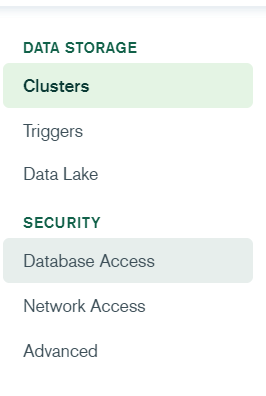
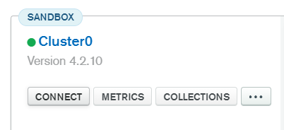

# Making a MongoDB Atlas Cluster

## Registering an Account
1. Head Over to [MongoDB Atlas Cloud Registration Page](https://www.mongodb.com/cloud/atlas/register) and register using your Google Account.

## Making a Cluster
1. You can create a cluster which is absolutely free, no credit cards needed. But if you want higher storage and performance, you're free to get a paid one. (Not recommended if you're using the bot in just one server)
2. Select Your cloud Provider & Region. Make sure you choose a region closest to you
3. Cluster Tier - The Default will be set to the free tier, you can change this if you're willing to pay.
4. Now for the cluster name, you can use any name you want.
5. Now hit Create Cluster, It May take a couple of minutes so let it do its job.

## Getting Connection URL
1. The most important thing and the thing you need for this installation, is the MongoDB database connection URL.
2. Now on the left sidebar you'll see some options  
  
3. Click on add a new Database user
4. Choose the Authentication Method as Password. Now Add a Username and a password (Make Sure You Remember Both)
> You May also generate a random and powerful password if you can't think of a good one.
5. You Can set the Database User Privileges to either `Atlas Admin` or `Read and Write data to any database`
6. Now come back to Clusters and click on the Connect button  
  
7. For the IP Address, You will have to choose `Allow Access from Anywhere` so that your bot can access the database
8. Now you're at the `Choose a Connection Method` window, Choose the third option which is the `Connect using MongoDB Compass`
9. You don't need to download MongoDB for now, but if you want, you can.
10. Now copy the connection string, it will look something like this -  
`mongodb+srv://testing:<password>@cluster0.xxxxx.mongodb.net/test`  
Or something like this if you have made multiple Database users  
`mongodb+srv://<username>:<password>@cluster0.xxxxx.mongodb.net/test`
11. Now You'll need to replace `<username>` with your database user username and `<password>` with yur database user password.
12. You're all good! Now paste the URL in the .env file
